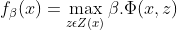

<!-- Object Detection with Discriminatively Trained Part Based Models -->

# Survey on Object Detection with Discriminatively Trained Part Based Models.
This is a review of the paper *Object Detection with Discriminatively Trained Part Based Models* by **Pedro F. Felzenszwalb, Ross B. Girshick, David McAllester and Deva Ramanan**.

# Introduction :
This paper tries to solve the problem of detecting different objects with variations such as illumination, viewpoint and most importantly intra-class variability.
For example, if we take humans for instance, they can be in different poses and can wear different color dresses.

To tackle this variations, this paper represents an object using mixtures of multi-scale deformable part models.
This method was able to achieve state of the art results then, with both PASCAL VOC and INRIA dataset.

This paper extends from the paper pictorial structures, it is a way of representing objects by parts arranged in a deformable configuration.
Here they also try to model objects with visual grammars rather than just deformable parts to generalize intra-class variations.

This paper is kind of a transformed form of HOG by Dalal-Triggs.
An object in a particular frame is given by the score of a star model at particular position and scale within an image.
The score of a star model is calculated by the sum of scores of root filter, all part filters, placement of the part filter minus a deformation cost which accounts for deviation of the part.

Part filter scores are calculated at twice the spatial resolution that we use to calculate root filter.

Here they use latent SVM rather than a simple SVM, since the data is only partially labeled.

The score is computed by:

