<!-- Histograms of Oriented Gradients for Human Detection -->
 
# Survey on Histograms of Oriented Gradients for Human Detection.
This is a review of the paper *Histograms of Oriented Gradients for Human Detection* by **Navneeth Dalal and Bill Triggs**.
 
## Introduction
This paper is an advancement in extracting feature sets and SVM-based object detection.
This paper works on detecting humans(pedestrians).
They show that Locally normalized Histogram of Oriented Gradient descriptors edges over all the then existing methods of feature extractors.

#### Flow of the review :
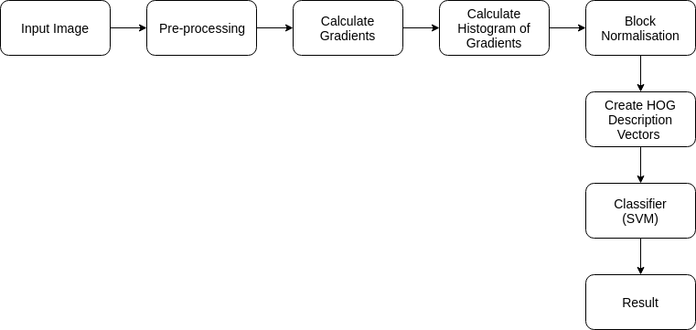

#### Dataset used : 
Created their own dataset of 1800 images since the accuracy of this method on the MIT pedestrians dataset is so high.
This dataset contains all kinds of changes in pose, view angles, and backgrounds.
Out of which 1239 images had persons (2478 after mirroring) - positives.
12180 windows of non-persons from 1218 selected at random - negatives.

They retrain the model with false positives given by the baseline model created with these images - hard examples of negatives.
Those non-human windows detected as humans are windows with which the SVM classifier had a hard time classifying it, hence adding to the negative set that eventually had a significant improvement in performance (by 5% low false positive rate).

## Method introduced :
The method introduced here is that a local object can be described by the distribution of gradients of intensities (magnitude and directions) without any knowledge of the location of the gradients or edge themselves.
The Gradient of the image indicates the directional change in intensity or color in image.
A sliding detector window(64*128) is moved around the image at different scales of the image, a HOG descriptor is computed and the SVM classifies it into a person or not a person. (See Figure1.1, 1.2)
We extract features from an image by using magnitude of Gradient and its direction.
First, they separate a window into small cells(8*8) and on each cell a histogram of gradient directions are created (a 9-bin histogram).
Each bin corresponds to 20 degrees, so 9 bins histogram ranges from 0 to 180 degrees.
Those combined histogram values is used to represent the direction of the cell.
These responses from each cell are normalized to provide invariance to illumination.
Normalization is usually done in a comparatively bigger spatial region called blocks (group of cells) which is the **Histogram of Oriented Gradient *(HOG)* descriptors** of a single window.
And these descriptors are fed into a classifier to detect a human in the window using **SVM**.

A Similar kind of work has been published in **Lowe's Scale Invariant Feature Transformation (SIFT)**.
Unlike SIFT, it uses a global feature to describe the object rather than local descriptors unlike.
This method was able to surpass all papers' accuracy then and provided the lowest false positive rates.

**Figure 1.1**

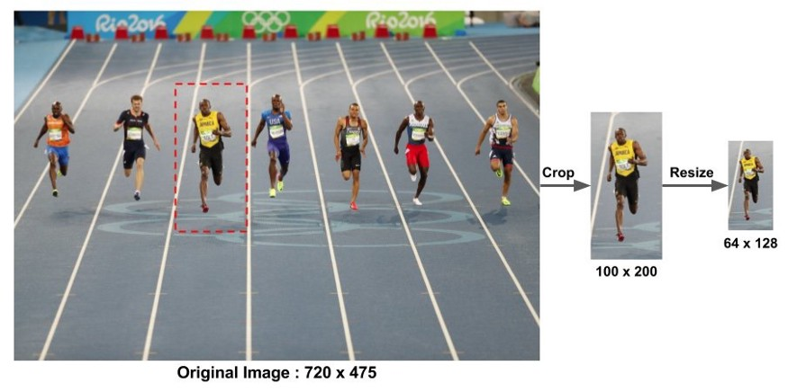

**Figure 1.2**

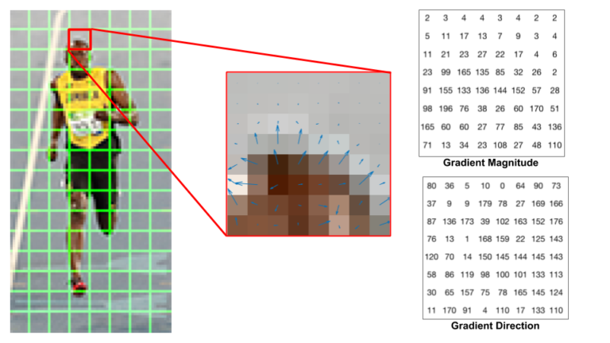

## Performance metrics : 
The main metric they used is *miss rate* versus **False positives per window** plotted as an ROC curve.
Miss rate:

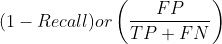 

An error rate of 0.8 false positives for an image of 640*480 pixels.
But the whole detector has a lower false positive rate after applying non-maxima suppression.
A reference point of 1 in 10000 false positives per window miss rate is fixed.
At the reference point, 1% deduction in miss rate is equivalent to reducing false positives by a factor of 1.57.

## Method implementation :
The detector has 64*128 sliding window, [-1, 0, 1] gradient image, vector of 9 orientation bins, 16*16 pixel blocks, L2 block normalization.
###### Gamma/Color normalization :
Giving in RGB and LAB color images gives better results than grayscale images.
It is found that, Square root gamma compression improves perfomance by 1% rather than log compression.
###### Gradient computation : 
After experiments with different Gaussian smoothing and masks, it is found that simple centred 1-D mask([-1, 0, 1]) with no Gaussian smoothing provides the best perfomance.
In simple, Gradient magnitude and direction can be computed as,

**For example**

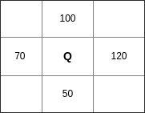

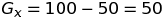

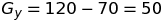

**Magnitude**

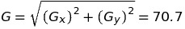

**Direction**

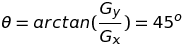

###### Spatial/Orientation binning : 
The bins range from 0 - 180 degrees instead of 0 to 360 degrees, i.e they have used unsigned gradients
We split the contribution of a vector between two of the closest bins to its orientation.
For example,

* If a gradient vector has an angle of 40 degrees, its magnitude is equally divided for both 30 degree bin and 50 degrees bin.
* Or If a gradient vector has an angle of 65 degrees, its magnitude is divided 1/4th to 50 degree bin and 3/4th of the magnitude to 70 degrees.

(See Figure 2.1, 2.2).

**Figure 2.1**

**Figure 2.2**

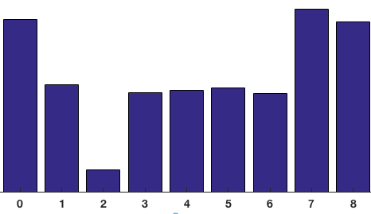

###### Normalization and Descriptor blocks:
Normalization of Gradients is needed to make them invariance to illumination and even contrast between regions of the same image.
It basically means, adding or subtracting brightness from the whole image would still give you the gradient vectors at each pixel.
Cells are grouped into larger spatial blocks and each block is normalized separately.
The final descriptor is the vector of all components of the normalized cell responses from all of the block in detection window.
Since the blocks are overlapped, so that each cell contributes to several components.
Here the authors examine two kinds of blocks namely, R-HOG and C-HOG 
###### * R-HOG :
R-HOGs are blocks partitioned into grids of square or rectangular cells similar to SIFT decriptors.
Unlike SIFT, spatial cells computed are dense and are at a single scale.
By experiments, it is found that a block size of 2*2 has less false positives per window.
###### * C-HOG :
C-HOGs are blocks partitioned into grids of log-polar fashion cells similar to Shape Contexts.
The descriptors are small with very few radial bins like centre-surround coding.
There are two variants of C-HOG, in which we take circular-centre variant considering computational speed.
It is found that should be four angular bins in the surrounding and the radius of the central bin should be 4 pixels, outer radius 8 pixels for the best results. 
###### * Block Normalization schemes :
Out of four block different normalization schemes, L2-norm, L2-Hys, L1-norm, L1-sqrt out of which L1-norm had the worst performance.
Any of these 3 can be used.
###### * Centre-surround normalization :
Another normalization scheme called centre-surround normalization is tested wherein the cells in an image is normalized using the total energy in the cell and its surrounding cells.
But this produces more false positives compared to block based normalization schemes.
###### Detector window and context :
Detection window of 64*128 (usually, 1:2) has about 16 pixels of margin around the person considering height to width of an average person.
The detection window is divided into 7 blocks across and 15 blocks vertically.
A total of 105 blocks are present in a detection window.
Each block has 4 cells and each cell has 9-bin histogram.
The final feature vector will be the concatenation of feature vectors of all blocks in the window.
So the final vector size before it fed into a classifier is 7*15*4*9 = 3780. 

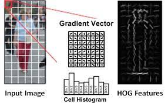
###### Classifier :
Here a simple linear SVM is used as a classifier. Though Gaussian kernel SVM increases performance by 3%, taking computation speed into consideration, linear SVM classifier is used.
## Results :
HOG-based detectors outperforms Haar-wavelets based detectors, PCA-SIFT and Shape Context.
HOG gives almost perfect separation on MIT dataset.
And also it performs well in INRIA dataset. 
The perfomance of R-HOG and C-HOG gives similar results, C-HOG has a slight upper hand.
As said linear SVM replaced with Gaussian kernel SVM provides good result but with a cost in computational time.

